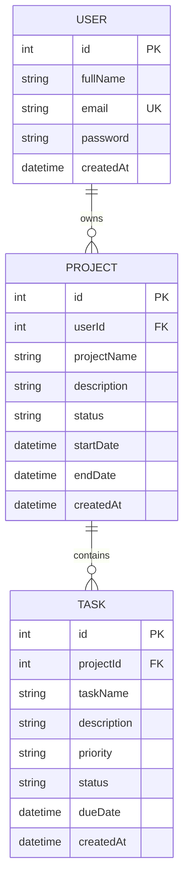

# Project Management System

A full-stack Project Management System designed to help authenticated users create, manage, track, and organize projects and tasks through a secure RESTful API and web interface.

## Live Demo

* **Frontend:** https://projectmanagementsyst.netlify.app/
* **Backend API:** https://project-management-system-wgoc.onrender.com

## Features

### Authentication & Security

* User registration and login
* Secure password hashing using bcryptjs
* JWT-based authentication
* Protected API routes using authentication middleware
* User ownership and data isolation
* Authentication rate limiting
* Request validation
* Helmet security middleware
* CORS configuration
* Environment variables for sensitive configuration

### Project Management

* Create projects
* View projects
* View individual project details
* Update projects
* Delete projects
* Project status management
* Project start and end dates
* User-specific project ownership

### Task Management

* Create tasks under selected projects
* View tasks
* Update tasks
* Delete tasks
* Task priority management
* Task status management
* Task completion tracking
* Task due dates
* Project-based task ownership

### Dashboard & Productivity

* Project and task statistics
* Task status summary
* Search projects and tasks
* Filter tasks by status
* Project selection while creating tasks

## Tech Stack

### Frontend

* React
* Vite
* JavaScript
* CSS

### Backend

* Node.js
* Express.js
* JavaScript
* REST API

### Database

* TiDB Cloud
* MySQL-compatible relational database
* Prisma ORM
* TiDB Cloud Prisma Adapter

### Security

* bcryptjs
* JSON Web Tokens (JWT)
* Helmet
* CORS
* Express Rate Limit
* Environment variables

## Project Structure

```text
project-management-system/
│
├── backend/
│   ├── prisma/
│   │   ├── migrations/
│   │   └── schema.prisma
│   │
│   ├── src/
│   │   ├── controllers/
│   │   │   ├── projectController.js
│   │   │   ├── taskController.js
│   │   │   └── userController.js
│   │   │
│   │   ├── middleware/
│   │   │   └── authMiddleware.js
│   │   │
│   │   ├── routes/
│   │   │   ├── authRoutes.js
│   │   │   ├── projectRoutes.js
│   │   │   ├── taskRoutes.js
│   │   │   └── userRoutes.js
│   │   │
│   │   ├── utils/
│   │   │   └── prisma.js
│   │   │
│   │   └── server.js
│   │
│   ├── prisma7.config.ts
│   ├── package.json
│   └── .env
│
├── frontend/
│   ├── src/
│   │   ├── App.jsx
│   │   ├── App.css
│   │   └── main.jsx
│   │
│   ├── package.json
│   └── ...
│
├── .gitignore
└── README.md
```

> `.env` and `node_modules` are excluded from version control using `.gitignore`.

## API Documentation

### Base URL

```text
https://project-management-system-wgoc.onrender.com
```

### Authentication

| Method | Endpoint             | Description                 |
| ------ | -------------------- | --------------------------- |
| POST   | `/api/auth/register` | Register a new user         |
| POST   | `/api/auth/login`    | Login and receive JWT token |
| POST   | `/api/auth/logout`   | Logout response             |

Protected endpoints require:

```text
Authorization: Bearer <JWT_TOKEN>
```

### Users

| Method | Endpoint     | Description          |
| ------ | ------------ | -------------------- |
| GET    | `/api/users` | Get registered users |
| POST   | `/api/users` | Create a user        |

### Projects

| Method | Endpoint            | Description                       |
| ------ | ------------------- | --------------------------------- |
| POST   | `/api/projects`     | Create a project                  |
| GET    | `/api/projects`     | Get authenticated user's projects |
| GET    | `/api/projects/:id` | Get a specific project            |
| PUT    | `/api/projects/:id` | Update a project                  |
| DELETE | `/api/projects/:id` | Delete a project                  |

### Tasks

| Method | Endpoint         | Description                    |
| ------ | ---------------- | ------------------------------ |
| POST   | `/api/tasks`     | Create a task                  |
| GET    | `/api/tasks`     | Get authenticated user's tasks |
| PUT    | `/api/tasks/:id` | Update a task/status           |
| DELETE | `/api/tasks/:id` | Delete a task                  |

## Database Design

The application uses three main relational models:

1. **User** – Stores user account information.
2. **Project** – Stores project details and belongs to a user.
3. **Task** – Stores task details and belongs to a project.

### Relationships

* One User can have many Projects.
* One Project can have many Tasks.
* Projects belong to a User through `userId`.
* Tasks belong to a Project through `projectId`.
* Cascading delete is used for related project and task records.

### ER Diagram



## Security Implementation

The application implements several security measures:

* Passwords are hashed using bcryptjs before being stored.
* JWT tokens are used for authenticated API access.
* Protected routes use authentication middleware.
* Users can only access their own projects and related tasks.
* Authentication endpoints are protected using rate limiting.
* Helmet is used for HTTP security headers.
* Prisma ORM provides parameterized database operations.
* Sensitive configuration is stored in environment variables.
* `.env` is excluded from Git using `.gitignore`.
* CORS is configured for frontend-backend communication.

## Installation

### 1. Clone the repository

```bash
git clone https://github.com/Sughapriyarajan/project-management-system.git
```

### 2. Navigate to the backend

```bash
cd project-management-system/backend
```

### 3. Install backend dependencies

```bash
npm install
```

### 4. Configure environment variables

Create a `.env` file inside the `backend` folder.

Example:

```env
PORT=5000

DB_HOST=your_database_host
DB_PORT=4000
DB_USERNAME=your_database_username
DB_PASSWORD=your_database_password
DB_DATABASE=project_management

JWT_SECRET=your_jwt_secret
```

> Never commit the `.env` file or expose database credentials and JWT secrets.

### 5. Generate Prisma Client

```bash
npx prisma generate
```

### 6. Start the backend

```bash
npm run dev
```

The backend will run locally on:

```text
http://localhost:5000
```

### 7. Start the frontend

Open a new terminal and navigate to the frontend:

```bash
cd project-management-system/frontend
```

Install dependencies:

```bash
npm install
```

Start the development server:

```bash
npm run dev
```

The frontend will normally run on:

```text
http://localhost:5173
```

### Database

The deployed application uses **TiDB Cloud**, a MySQL-compatible cloud database.

The production database schema contains the following tables:

* `User`
* `Project`
* `Task`

Database credentials are configured through environment variables and are not stored in the repository.

## Testing

The following core functionality has been implemented and tested:

* User registration
* User login
* JWT authentication
* Logout
* User-specific project access
* Project creation
* Project editing
* Project deletion
* Task creation
* Task project selection
* Task status update
* Task editing
* Task deletion
* Project search
* Task search
* Task status filtering

## Environment Variables

The following environment variables are required for the backend:

| Variable      | Description                        |
| ------------- | ---------------------------------- |
| `DB_HOST`     | TiDB Cloud database host           |
| `DB_PORT`     | Database port                      |
| `DB_USERNAME` | Database username                  |
| `DB_PASSWORD` | Database password                  |
| `DB_DATABASE` | Database name                      |
| `JWT_SECRET`  | Secret key used to sign JWT tokens |
| `PORT`        | Backend server port                |

> Production environment variables are configured securely on the hosting platform and are not committed to GitHub.

## Deployment

### Frontend

The React frontend is deployed on Netlify:

```text
https://projectmanagementsyst.netlify.app/
```

### Backend

The Express REST API is deployed on Render:

```text
https://project-management-system-wgoc.onrender.com
```

### Database

The production database is hosted on TiDB Cloud.

## Author

Sughapriya R

B.Tech Information Technology
